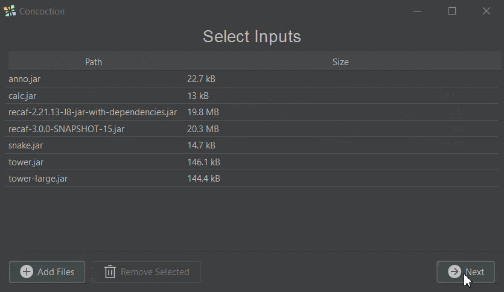

# Concoction

A shared Java malware scanner capable of static and dynamic analysis.

## Usage

Concoction can be used either as a Java library or as a command line application.

### Scan models

The format of scan models is described [here](docs/ModelFormat.md).

### As a library

First add Concoction as a library to your project. It is available on maven central:
```xml
<!-- Maven dependency declaration, for the latest version see the project releases page -->
<dependency>
    <groupId>info.mmpa</groupId>
    <artifactId>concoction</artifactId>
    <version>${version}</version>
</dependency>
```
```groovy
// Gradle dependency declaration
implementation "info.mmpa:concoction:${version}"
```

For code examples on using Concoction as a library, see [the test cases](concoction-lib/src/test/java/info/mmpa/concoction).

### As a GUI application



Concoction is available as a Java application, requiring at least Java 8, that allows you to:
- Choose files to scan
- Choose models to match against
- Act on detections in provided files
  - Export detection reports as a ZIP archive
  - Delete files with detections, with the option to exclude certain entries

### As a command line application

Usage as shown from `--help`:
```shell
Usage: Concoction [-h] [-v] [-V] [-dd=<directoryDepth>] [-i=<input>]
                  [-id=<inputDir>] [-im=<archiveMode>] [-m=<model>]
                  [-md=<modelDir>] [-rcm=<consoleOutputMode>]
Dynamic Shared Malware Scanner
  -dd, --dirDepth=<directoryDepth>
                            Directory depth to scan for with --modelDir and
                              --inputDir
  -h, --help                Show this help message and exit.
  -i, --input=<input>       Path to single file to scan (jar)
  -id, --inputDir=<inputDir>Directory containing files to scan (jar)
  -im, --inputMode=<archiveMode>
                            Mode to use when parsing jar/zip files.
                             - RANDOM_ACCESS_JAR: Used when inputs are loaded
                              dynamically via 'java.util.zip.ZipFile' or 'java.
                              util.zip.JarFile'
                             - RUNNABLE_JAR:      Used when inputs are treated
                              as a program run via 'java -jar' or 'java -cp'
                             - STREAMED_JAR:      Used when inputs are loaded
                              dynamically via streaming such as with 'java.util.
                              zip.ZipInputStream' or 'java.util.zip.
                              JarInputStream'

  -m, --model=<model>       Path to single concoction scan model file (json)
  -md, --modelDir=<modelDir>Directory containing concoction scan model files
                              (json)
  -rcm, --resultsConsoleMode=<consoleOutputMode>
                            Console output display mode for results
  -v, --verbose             Enables more verbose logging and error details
  -V, --version             Print version information and exit.
```

Upon scan completion, results are printed to the console based on the value provided by `--resultsConsoleMode`.
Currently, the output format is CSV form. The first column is the file path, and the second column is the 
detections matched, separated by `:`.

An example of the CSV output would look like:
```csv
mods/Sample1.jar,detection1
mods/Sample1and2.jar,detection2:detection2
```

The application's exit codes also indicate the scan status.

- Negative values indicate errors reading inputs
- Zero indicates no detections were found
- Positive values indicate the number of files with detections found